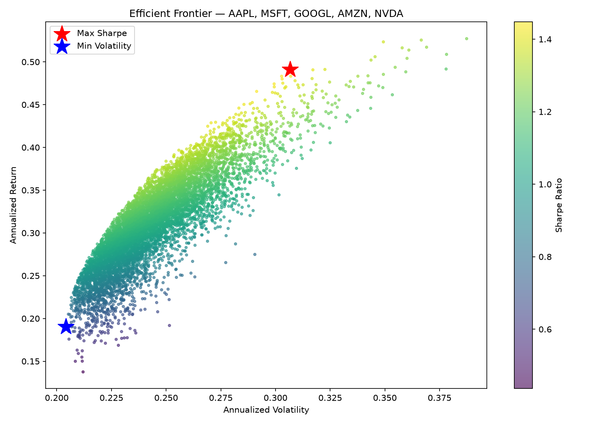
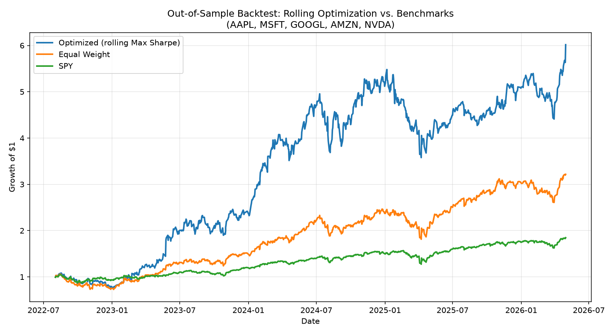

# Quantitative Portfolio Optimizer & Walk-Forward Backtester

An end-to-end asset allocation engine built in Python using Modern Portfolio Theory (MPT). The system uses `scipy.optimize` to solve for the Markowitz Efficient Frontier via constrained optimization, backed by an 8,000-iteration Monte Carlo simulation.

Crucially, it goes beyond a static frontier plot by implementing a **walk-forward, out-of-sample rolling backtester** — re-optimizing on trailing historical windows and testing on unseen future periods — to evaluate whether mean-variance optimization actually adds value once look-ahead bias is removed, and how sensitive that value is to the optimizer's own configuration.

**Tickers analyzed:** AAPL, MSFT, GOOGL, AMZN, NVDA · **Benchmark:** SPY

---

## Features

- **Modern Portfolio Theory Analysis** — closed-form calculation of the Max Sharpe and Min Volatility portfolios via `scipy.optimize.minimize` (SLSQP, long-only, fully-invested constraint), visualized against an 8,000-portfolio Monte Carlo cloud.
- **Walk-Forward Out-of-Sample Backtesting** — trains on a trailing window (e.g. 12 months), holds those weights fixed, and tests on the *next* unseen period, rolling forward through history. No parameter is ever fit on data it's later evaluated against.
- **Comparative Benchmarking** — every strategy is measured against a naive Equal-Weight (1/N) portfolio and the S&P 500 (SPY).
- **Sensitivity Analysis** — the backtest is re-run across different training-window lengths and rebalance frequencies to test whether conclusions are robust or an artifact of one configuration.

---

## Results

### 1. Static Efficient Frontier (3-year lookback)



| Portfolio | AAPL | MSFT | GOOGL | AMZN | NVDA | Exp. Return | Volatility | Sharpe |
|---|---|---|---|---|---|---|---|---|
| **Max Sharpe** | 0.00% | 0.00% | 59.52% | 0.00% | 40.48% | 49.11% | 30.66% | **1.46** |
| **Min Volatility** | 32.24% | 0.90% | 21.36% | 45.50% | 0.00% | 19.04% | 20.42% | 0.71 |

Even at a single point in time, the Max Sharpe solution is a corner solution — it allocates to only 2 of 5 assets. This is a known property of unconstrained mean-variance optimization (it tends toward extreme, concentrated weights) and foreshadows the risk-concentration behavior seen in the rolling backtest below.

### 2. Walk-Forward Backtest — Base Case (12mo train / 3mo rebalance)



| Strategy | Ann. Return | Ann. Vol | Sharpe | Max Drawdown | Total Return (5y) |
|---|---|---|---|---|---|
| **Optimized (rolling Max Sharpe)** | 54.55% | 37.76% | **1.33** | -34.73% | 501.64% |
| Equal Weight | 34.46% | 26.52% | 1.13 | -31.09% | 221.54% |
| SPY | 17.60% | 16.41% | 0.80 | -18.76% | 84.67% |

Out-of-sample, the optimizer beat both baselines on every metric except drawdown magnitude. This is a stronger result than a naive static backtest would suggest, because these weights were never allowed to see the returns they're being scored on.

### 3. Sensitivity Analysis

The base case uses one specific configuration (12-month training window, quarterly rebalance). To test whether the result is robust or a lucky configuration, the backtest was re-run across three variations:

| Configuration | Strategy | Ann. Return | Ann. Vol | Sharpe | Max Drawdown |
|---|---|---|---|---|---|
| **6mo window, 3mo rebal** | Optimized | 33.22% | 34.80% | **0.83** | **-49.52%** |
| | Equal Weight | 28.24% | 28.82% | 0.82 | -41.23% |
| | SPY | 13.74% | 17.69% | 0.52 | -22.33% |
| **12mo window, 3mo rebal** *(base case)* | Optimized | 54.55% | 37.76% | **1.33** | -34.73% |
| | Equal Weight | 34.46% | 26.52% | 1.13 | -31.09% |
| | SPY | 17.60% | 16.41% | 0.80 | -18.76% |
| **24mo window, 3mo rebal** | Optimized | 61.84% | 43.97% | **1.30** | -38.85% |
| | Equal Weight | 34.08% | 24.09% | 1.23 | -26.42% |
| | SPY | 18.93% | 15.54% | 0.93 | -18.76% |
| **12mo window, 1mo rebal** | Optimized | 59.52% | 38.84% | **1.42** | -41.24% |
| | Equal Weight | 32.96% | 26.23% | 1.08 | -31.81% |
| | SPY | 18.43% | 16.22% | 0.86 | -18.53% |

---

## Key Findings & Quantitative Insights

**1. The optimizer's edge is real but window-dependent — and shrinks sharply with less training data.**
- **The Data:** With a 12-month training window, the optimized strategy's Sharpe ratio (1.33) clearly beats equal-weight (1.13). Cut the training window to 6 months, and that edge nearly vanishes: Sharpe drops to 0.83, barely above equal-weight's 0.82, while max drawdown *worsens* dramatically to -49.52% (versus -41.23% for equal-weight).
- **The Quant Reality:** With only 6 months of return history, the covariance and mean-return estimates are noisy, and the optimizer confidently allocates large weights based on that noise — a textbook illustration of **Markowitz's estimation-error problem**. Naive mean-variance optimization is hyper-sensitive to its inputs, and short windows yield parameters that are mostly noise. This is the single clearest result in the whole analysis — the optimizer's advantage isn't free, it's conditional on having enough data to estimate parameters reliably.

**2. More frequent rebalancing improved results here, but likely because it tracks momentum faster — not "for free."**
- **The Data:** Moving from quarterly to monthly rebalancing (same 12-month window) increased Sharpe from 1.33 to 1.42 and total return from 501.64% to 705.25%.
- **The Quant Reality:** This is consistent with the optimizer reacting faster to the ongoing GOOGL/NVDA momentum run — it re-estimates weights more often and stays concentrated in whatever has recently outperformed. Real-world transaction costs and slippage (not modeled here) would heavily decay this advantage; the reported numbers represent an uncosted upper bound on what monthly rebalancing would achieve in practice.

**3. Longer training windows increased raw return but not necessarily Sharpe, and shrank the test period.**
The 24-month window produced the highest raw return (61.84%) and total return improvement, but its Sharpe (1.30) was actually marginally *lower* than the 12-month base case (1.33), and it came with the largest volatility (43.97%) of any configuration. It's also worth flagging that a 24-month training window, applied to only 5 years of history, leaves roughly 3 years of genuine out-of-sample testing rather than 4 — a smaller, noisier sample of results than the other configurations.

**4. The mechanism behind the outperformance is concentration in a bull market, which cuts both ways.**
Across every configuration, the optimizer's edge traces back to the same behavior seen in the static frontier: heavy concentration in GOOGL and NVDA, the two strongest performers in the basket over this period. That concentration is exactly why the optimized strategy's max drawdown is consistently 10–15 percentage points worse than SPY's — the same weights that captured the upside also amplified the downside. In a regime where AI/tech momentum reversed instead of continuing, this same optimizer behavior would very plausibly have underperformed, not outperformed, equal-weight.

**Overall takeaway:** mean-variance optimization added genuine, risk-adjusted value over this specific 5-year AI/tech bull-market period — but the sensitivity analysis shows that value depends heavily on having a sufficiently long training window, and the mechanism driving it (momentum concentration) is a known source of fragility, not a robust structural edge. A shorter test window or a regime change would be a reasonable next stress test.

---

## Methodology

- **Objective:** Maximize Sharpe ratio `(annualized return − risk-free rate) / annualized volatility`, subject to weights summing to 1 and no short-selling (`0 ≤ w_i ≤ 1`). Solved via `scipy.optimize.minimize` (SLSQP).
- **Risk-free rate:** Fixed at 4.5% annualized, hardcoded — a rough average across the backtest window, which spans the near-zero rates of 2021, the Fed's 2022–2023 hiking cycle to a peak of 5.25–5.50%, and the subsequent easing cycle back down to ~3.50–3.75% by mid-2026. Not adjusted dynamically over the period.
- **Walk-forward procedure:** For each rebalance date, the optimizer trains only on the trailing `window` months of daily returns, then the resulting fixed weights are applied to the *next* `rebalance` months of actual (unseen) daily returns before re-optimizing. This ensures no test-period data ever leaks into training.
- **Benchmarks:** Equal-weight (1/N across all 5 tickers) and SPY, computed over the same out-of-sample date range for direct comparability.
- **Data source:** Adjusted daily close prices via `yfinance`.

## Future Extensions

- **Covariance Shrinkage:** Implement the Ledoit-Wolf or Oracle Approximating Shrinkage (OAS) estimator to condition the covariance matrix, specifically targeting the parameter noise observed in the 6-month window variation.
- **Transaction Cost Modeling:** Incorporate a linear/quadratic slippage and fee model (e.g., 5-10 bps per trade) to test whether the monthly-rebalance Sharpe improvement (1.33 → 1.42) survives realistic trading costs.
- **Regime-Aware Testing:** Extend the backtest to a longer or more diversified universe to check whether the optimizer's edge holds outside this specific AI/tech bull-market period.

## Limitations

- All 5 tickers are mega-cap tech names that shared a strong, correlated bull run over this specific test period — results likely overstate how well this approach generalizes to a more diversified universe or a different market regime.
- No transaction costs, slippage, taxes, or market-impact modeling — the monthly-rebalance result in particular would look worse net of realistic trading costs.
- Assumes returns are well-approximated by mean-variance (no fat tails, skew, or regime-switching).
- No shrinkage estimator (e.g. Ledoit-Wolf) applied to the covariance matrix — a natural next step to reduce the estimation-error sensitivity seen in the 6-month window case.

## How to Run

```bash
pip install -r requirements.txt

# Static efficient frontier + Monte Carlo simulation
python portfolio_optimizer.py --tickers AAPL MSFT GOOGL AMZN NVDA --years 3

# Walk-forward backtest (base case)
python rolling_backtest.py --tickers AAPL MSFT GOOGL AMZN NVDA --years 5 --window 12 --rebalance 3 --benchmark SPY

# Sensitivity checks
python rolling_backtest.py --tickers AAPL MSFT GOOGL AMZN NVDA --years 5 --window 6  --rebalance 3 --benchmark SPY --out rolling_backtest_w6.png
python rolling_backtest.py --tickers AAPL MSFT GOOGL AMZN NVDA --years 5 --window 24 --rebalance 3 --benchmark SPY --out rolling_backtest_w24.png
python rolling_backtest.py --tickers AAPL MSFT GOOGL AMZN NVDA --years 5 --window 12 --rebalance 1 --benchmark SPY --out rolling_backtest_monthly.png
```

`rolling_backtest.py` imports directly from `portfolio_optimizer.py` — keep both files in the same directory.

## Requirements

```
yfinance
numpy
pandas
matplotlib
scipy
```

## Tech Stack

Python · NumPy · pandas · SciPy (`scipy.optimize`) · Matplotlib · yfinance